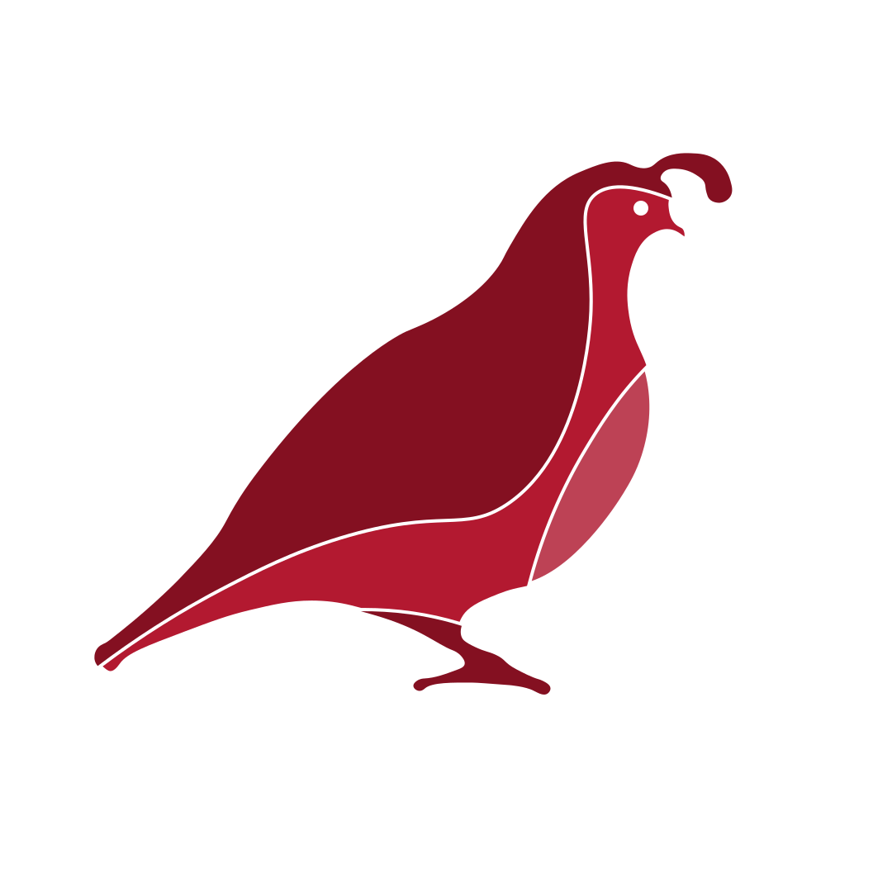

## Ruby Quail's advice for designers
4th of May, 2023

   ---

### Who the hell am I?

- Ruby Quail (pronouns: she/her)
- Graduated from RMIT Industrial Design in 2018
- Worked at design consultancy "Paper Giant" in 2019
- In 2020, service designer at Victoria Legal Aid
- In ’21, “experience” design at a small consultancy called ByMany 
- Now I work for ACMI, a museum in the city, as a Creative Technologist

---

### Other Stuff
- Helped run Service Design Melbourne’s design and ethics committee from 2019 until last year
- In my spare time, I’m working on Dendrite: a standard for interoperable representations of system and service design diagrams
- I’ve done the odd panel talking about being a trans person in service design
- I have a small generative art practice 

---

# Give a shit
How to get a job and be a good designer

---

## Care about something

---

- Caring about things is rare in this industry
- 90% of actual design work in organisations is advocacy and activism.
- It is exhausting, but completely irreplaceable 

---

-  Find something you care about and immerse in it
-  Read about it, seek people who are closest to it
-  Talk about it, discuss it, tie it into your identity
-  If you don't have anything to care about, pick something cool and fake it

---

## Engage with people

---

- This industry is incredibly unstructured and nepotistic
- Especially outside the big players, e.g. big 4 consultancies, banks, insurance, etc
- This is admittedly harder because of the pandemic, but not impossible
- If you can do it earnestly, awesome, otherwise, get good at faking it
---

## Own your assumptions

---

- Design is about making assumptions and convincing others of them
- Those assumptions can be informed by research and data, but ultimately, you're drawing conclusions
- Look inward to what you're producing, understand your limitations and admit to them
---

- Design is very political, and while it changes quickly, you can't sit it out

- Don't get tied down to one framework or way of working, treat them as tools

---

## Final Thoughts

- You're probably designing a thing or a procedure, not an experience, make sure it works in that context first
- Talk about people, not users, and acknowledge any intermediaries.
- LLMs (like chatGPT) and GANs (mid-journey) are terrible at design, but they are great at things that look like design, which is going to make the activism and caring part of our jobs, wayyyyy more important.
